# ActionRPGProject — UML (Mermaid)

이 문서는 프로젝트의 **모든 C# 타입**(클래스 · 구조체 · 인터페이스 · 열거형)을 Mermaid 클래스 다이어그램으로 정리한 것이다.
한 장에 다 넣으면 읽을 수 없으므로 어셈블리 → 폴더(서브시스템) 단위로 나눴다.
각 클래스가 실제로 어떻게 협력하는지는 [Architecture.md](Architecture.md), GAS 상세는 [AbilitySystem.md](AbilitySystem.md) 에 있다.

> 기준 시점: 2026-10-02 (GAS 도입 이후), Unity 6000.3.24f1, Netcode for GameObjects 2.0.0

## 표기 규칙

| 표기 | 의미 |
|---|---|
| `<<NetworkBehaviour>>` / `<<MonoBehaviour>>` / `<<ScriptableObject>>` | Unity 기반 클래스. 화살표 대신 스테레오타입으로 표시한다 |
| `<<interface>>` `<<struct>>` `<<static>>` `<<abstract>>` `<<enumeration>>` | C# 타입 종류 |
| `A <\|-- B` | B 가 A 를 상속 |
| `A <\|.. B` | B 가 인터페이스 A 를 구현 |
| `A *-- B` | A 가 B 를 소유(구성) |
| `A o-- B` | A 가 B 를 참조 목록으로 보관(집합) |
| `A --> B` | A 가 B 를 직접 호출/참조 |
| `A ..> B` | A 가 B 를 사용(정적 호출, 이벤트 구독, 매개변수) |
| `+` / `-` / `#` / `~` | public / private / protected / internal |
| 이름 뒤 `$` | static 멤버 |
| 이름 뒤 `*` | abstract 멤버 |

멤버는 다른 클래스가 실제로 쓰는 public API 와 핵심 상태 위주로 적었다.

## 목차

0. [어셈블리 의존 관계](#0-어셈블리-의존-관계)
1. [Foundation — Core](#1-foundation--core)
2. [Foundation — GAS: 어트리뷰트 · 이펙트](#2-foundation--gas-어트리뷰트--이펙트)
3. [Foundation — GAS: 어빌리티 · 태스크 · 태그 · 큐](#3-foundation--gas-어빌리티--태스크--태그--큐)
4. [Foundation — GAS: AbilitySystemComponent](#4-foundation--gas-abilitysystemcomponent)
5. [Foundation — 인프라](#5-foundation--인프라)
6. [Foundation — Editor](#6-foundation--editor)
7. [Runtime — Abilities (GAS 게임 쪽)](#7-runtime--abilities-gas-게임-쪽)
8. [Runtime — Character · Combat](#8-runtime--character--combat)
9. [Runtime — Skills](#9-runtime--skills)
10. [Runtime — AI](#10-runtime--ai)
11. [Runtime — Networking](#11-runtime--networking)
12. [Runtime — Dungeon](#12-runtime--dungeon)
13. [Runtime — Tutorial](#13-runtime--tutorial)
14. [Runtime — Input · UI · Save · Data](#14-runtime--input--ui--save--data)
15. [Editor 도구](#15-editor-도구)
16. [전체 개요](#16-전체-개요)

---

## 0. 어셈블리 의존 관계

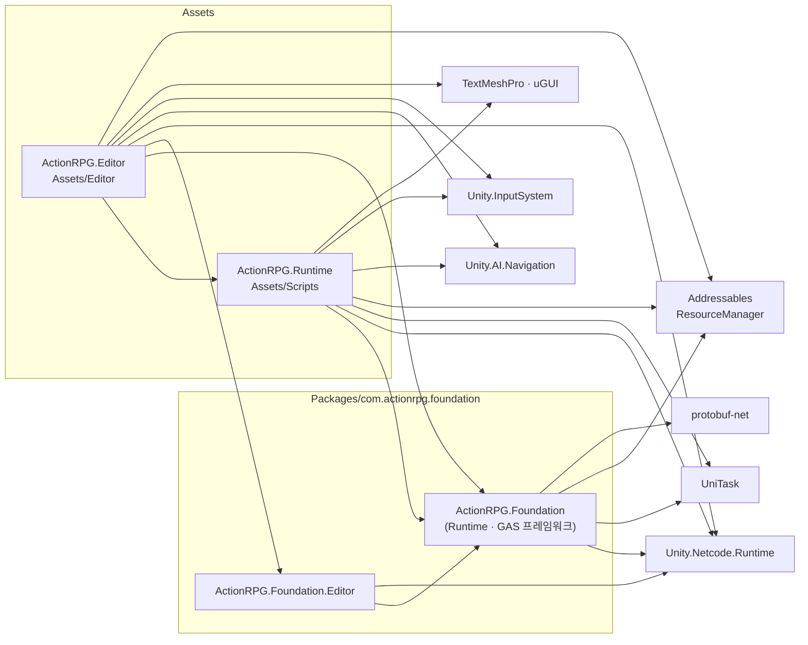
```mermaid
flowchart LR
    subgraph PKG["Packages/com.actionrpg.foundation"]
        F["ActionRPG.Foundation<br/>(Runtime · GAS 프레임워크)"]
        FE["ActionRPG.Foundation.Editor"]
    end
    subgraph AST["Assets"]
        R["ActionRPG.Runtime<br/>Assets/Scripts"]
        E["ActionRPG.Editor<br/>Assets/Editor"]
    end

    NGO["Unity.Netcode.Runtime"]
    UT["UniTask"]
    ADR["Addressables<br/>ResourceManager"]
    PB["protobuf-net"]
    NAV["Unity.AI.Navigation"]
    INP["Unity.InputSystem"]
    UI["TextMeshPro · uGUI"]

    FE --> F
    FE --> NGO
    F --> NGO
    F --> UT
    F --> ADR
    F --> PB

    R --> F
    R --> NGO
    R --> UT
    R --> ADR
    R --> NAV
    R --> INP
    R --> UI

    E --> R
    E --> F
    E --> FE
    E --> NGO
    E --> NAV
    E --> INP
    E --> UI
    E --> ADR
```

---

## 1. Foundation — Core

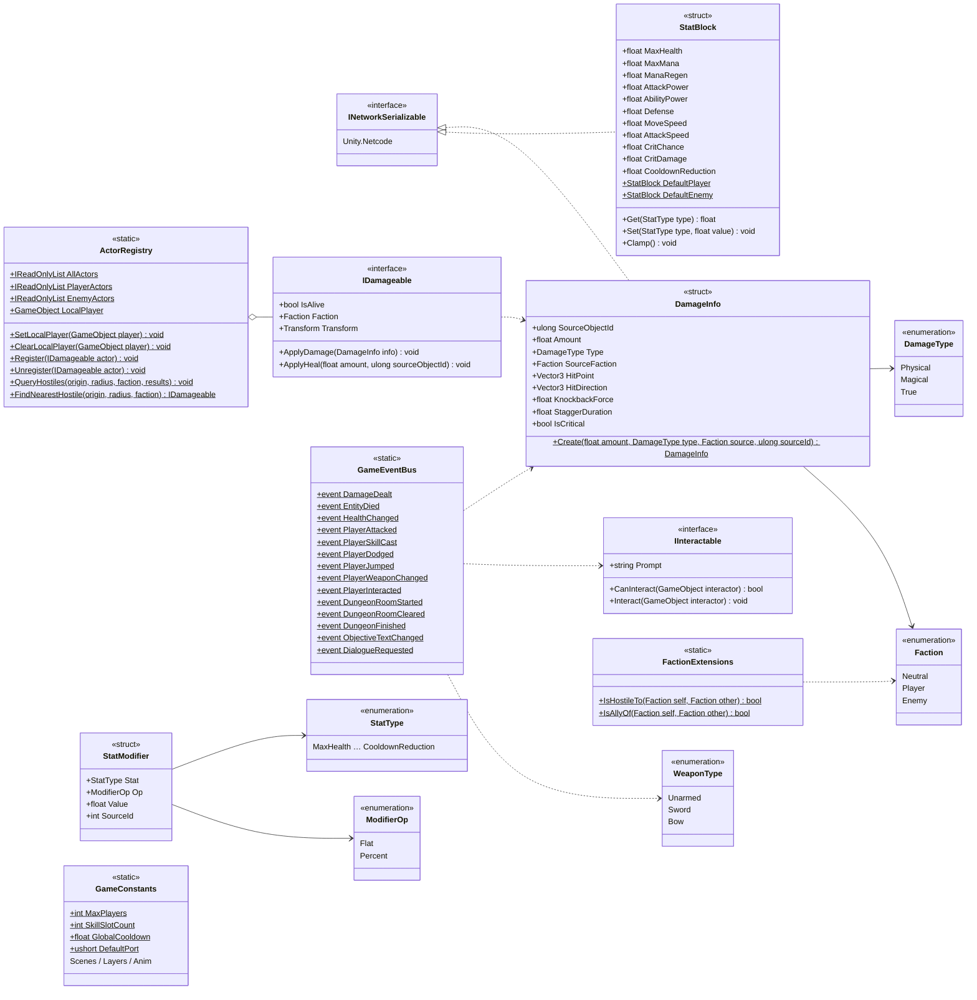
```mermaid
classDiagram
    direction LR

    class INetworkSerializable {
        <<interface>>
        Unity.Netcode
    }

    class IDamageable {
        <<interface>>
        +bool IsAlive
        +Faction Faction
        +Transform Transform
        +ApplyDamage(DamageInfo info) void
        +ApplyHeal(float amount, ulong sourceObjectId) void
    }

    class IInteractable {
        <<interface>>
        +string Prompt
        +CanInteract(GameObject interactor) bool
        +Interact(GameObject interactor) void
    }

    class DamageInfo {
        <<struct>>
        +ulong SourceObjectId
        +float Amount
        +DamageType Type
        +Faction SourceFaction
        +Vector3 HitPoint
        +Vector3 HitDirection
        +float KnockbackForce
        +float StaggerDuration
        +bool IsCritical
        +Create(float amount, DamageType type, Faction source, ulong sourceId)$ DamageInfo
    }

    class StatBlock {
        <<struct>>
        +float MaxHealth
        +float MaxMana
        +float ManaRegen
        +float AttackPower
        +float AbilityPower
        +float Defense
        +float MoveSpeed
        +float AttackSpeed
        +float CritChance
        +float CritDamage
        +float CooldownReduction
        +StatBlock DefaultPlayer$
        +StatBlock DefaultEnemy$
        +Get(StatType type) float
        +Set(StatType type, float value) void
        +Clamp() void
    }

    class StatModifier {
        <<struct>>
        +StatType Stat
        +ModifierOp Op
        +float Value
        +int SourceId
    }

    class ActorRegistry {
        <<static>>
        +IReadOnlyList AllActors$
        +IReadOnlyList PlayerActors$
        +IReadOnlyList EnemyActors$
        +GameObject LocalPlayer$
        +SetLocalPlayer(GameObject player)$ void
        +ClearLocalPlayer(GameObject player)$ void
        +Register(IDamageable actor)$ void
        +Unregister(IDamageable actor)$ void
        +QueryHostiles(origin, radius, faction, results)$ void
        +FindNearestHostile(origin, radius, faction)$ IDamageable
    }

    class GameEventBus {
        <<static>>
        +event DamageDealt$
        +event EntityDied$
        +event HealthChanged$
        +event PlayerAttacked$
        +event PlayerSkillCast$
        +event PlayerDodged$
        +event PlayerJumped$
        +event PlayerWeaponChanged$
        +event PlayerInteracted$
        +event DungeonRoomStarted$
        +event DungeonRoomCleared$
        +event DungeonFinished$
        +event ObjectiveTextChanged$
        +event DialogueRequested$
    }

    class GameConstants {
        <<static>>
        +int MaxPlayers$
        +int SkillSlotCount$
        +float GlobalCooldown$
        +ushort DefaultPort$
        Scenes / Layers / Anim
    }

    class FactionExtensions {
        <<static>>
        +IsHostileTo(Faction self, Faction other)$ bool
        +IsAllyOf(Faction self, Faction other)$ bool
    }

    class DamageType {
        <<enumeration>>
        Physical
        Magical
        True
    }
    class Faction {
        <<enumeration>>
        Neutral
        Player
        Enemy
    }
    class WeaponType {
        <<enumeration>>
        Unarmed
        Sword
        Bow
    }
    class StatType {
        <<enumeration>>
        MaxHealth … CooldownReduction
    }
    class ModifierOp {
        <<enumeration>>
        Flat
        Percent
    }

    INetworkSerializable <|.. DamageInfo
    INetworkSerializable <|.. StatBlock
    DamageInfo --> DamageType
    DamageInfo --> Faction
    StatModifier --> StatType
    StatModifier --> ModifierOp
    FactionExtensions ..> Faction
    IDamageable ..> DamageInfo
    ActorRegistry o-- IDamageable
    GameEventBus ..> DamageInfo
    GameEventBus ..> IInteractable
    GameEventBus ..> WeaponType
```

---

## 2. Foundation — GAS: 어트리뷰트 · 이펙트

`Packages/com.actionrpg.foundation/Runtime/AbilitySystem` · 네임스페이스 `ActionRPG.Core.AbilitySystem`

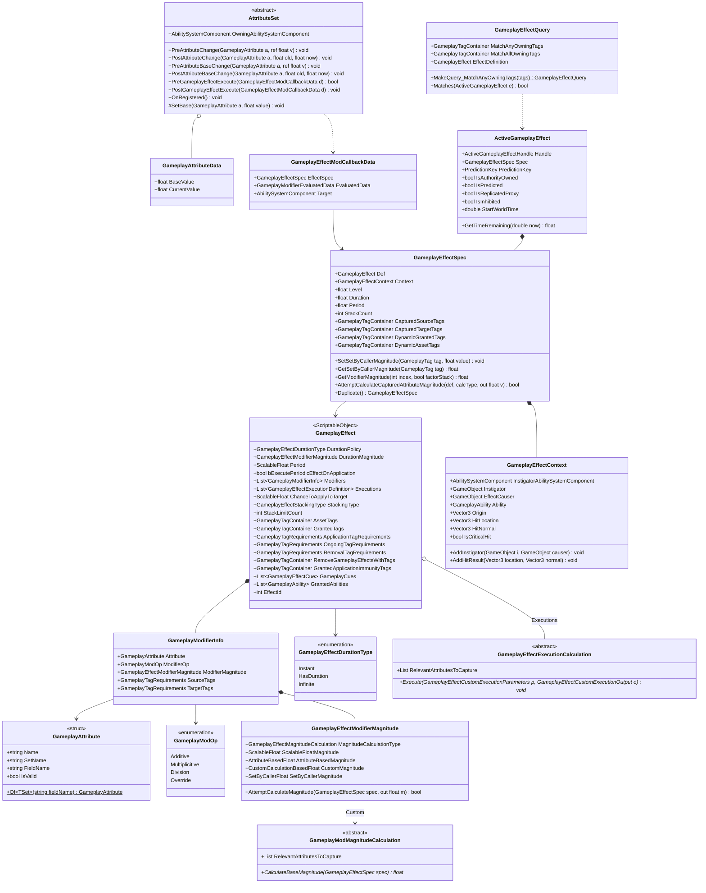
```mermaid
classDiagram
    direction TB

    class AttributeSet {
        <<abstract>>
        +AbilitySystemComponent OwningAbilitySystemComponent
        +PreAttributeChange(GameplayAttribute a, ref float v) void
        +PostAttributeChange(GameplayAttribute a, float old, float now) void
        +PreAttributeBaseChange(GameplayAttribute a, ref float v) void
        +PostAttributeBaseChange(GameplayAttribute a, float old, float now) void
        +PreGameplayEffectExecute(GameplayEffectModCallbackData d) bool
        +PostGameplayEffectExecute(GameplayEffectModCallbackData d) void
        +OnRegistered() void
        #SetBase(GameplayAttribute a, float value) void
    }

    class GameplayAttributeData {
        +float BaseValue
        +float CurrentValue
    }

    class GameplayAttribute {
        <<struct>>
        +string Name
        +string SetName
        +string FieldName
        +bool IsValid
        +Of~TSet~(string fieldName)$ GameplayAttribute
    }

    class GameplayEffect {
        <<ScriptableObject>>
        +GameplayEffectDurationType DurationPolicy
        +GameplayEffectModifierMagnitude DurationMagnitude
        +ScalableFloat Period
        +bool bExecutePeriodicEffectOnApplication
        +List~GameplayModifierInfo~ Modifiers
        +List~GameplayEffectExecutionDefinition~ Executions
        +ScalableFloat ChanceToApplyToTarget
        +GameplayEffectStackingType StackingType
        +int StackLimitCount
        +GameplayTagContainer AssetTags
        +GameplayTagContainer GrantedTags
        +GameplayTagRequirements ApplicationTagRequirements
        +GameplayTagRequirements OngoingTagRequirements
        +GameplayTagRequirements RemovalTagRequirements
        +GameplayTagContainer RemoveGameplayEffectsWithTags
        +GameplayTagContainer GrantedApplicationImmunityTags
        +List~GameplayEffectCue~ GameplayCues
        +List~GameplayAbility~ GrantedAbilities
        +int EffectId
    }

    class GameplayModifierInfo {
        +GameplayAttribute Attribute
        +GameplayModOp ModifierOp
        +GameplayEffectModifierMagnitude ModifierMagnitude
        +GameplayTagRequirements SourceTags
        +GameplayTagRequirements TargetTags
    }

    class GameplayEffectModifierMagnitude {
        +GameplayEffectMagnitudeCalculation MagnitudeCalculationType
        +ScalableFloat ScalableFloatMagnitude
        +AttributeBasedFloat AttributeBasedMagnitude
        +CustomCalculationBasedFloat CustomMagnitude
        +SetByCallerFloat SetByCallerMagnitude
        +AttemptCalculateMagnitude(GameplayEffectSpec spec, out float m) bool
    }

    class GameplayEffectSpec {
        +GameplayEffect Def
        +GameplayEffectContext Context
        +float Level
        +float Duration
        +float Period
        +int StackCount
        +GameplayTagContainer CapturedSourceTags
        +GameplayTagContainer CapturedTargetTags
        +GameplayTagContainer DynamicGrantedTags
        +GameplayTagContainer DynamicAssetTags
        +SetSetByCallerMagnitude(GameplayTag tag, float value) void
        +GetSetByCallerMagnitude(GameplayTag tag) float
        +GetModifierMagnitude(int index, bool factorStack) float
        +AttemptCalculateCapturedAttributeMagnitude(def, calcType, out float v) bool
        +Duplicate() GameplayEffectSpec
    }

    class GameplayEffectContext {
        +AbilitySystemComponent InstigatorAbilitySystemComponent
        +GameObject Instigator
        +GameObject EffectCauser
        +GameplayAbility Ability
        +Vector3 Origin
        +Vector3 HitLocation
        +Vector3 HitNormal
        +bool IsCriticalHit
        +AddInstigator(GameObject i, GameObject causer) void
        +AddHitResult(Vector3 location, Vector3 normal) void
    }

    class ActiveGameplayEffect {
        +ActiveGameplayEffectHandle Handle
        +GameplayEffectSpec Spec
        +PredictionKey PredictionKey
        +bool IsAuthorityOwned
        +bool IsPredicted
        +bool IsReplicatedProxy
        +bool IsInhibited
        +double StartWorldTime
        +GetTimeRemaining(double now) float
    }

    class GameplayEffectQuery {
        +GameplayTagContainer MatchAnyOwningTags
        +GameplayTagContainer MatchAllOwningTags
        +GameplayEffect EffectDefinition
        +MakeQuery_MatchAnyOwningTags(tags)$ GameplayEffectQuery
        +Matches(ActiveGameplayEffect e) bool
    }

    class GameplayModMagnitudeCalculation {
        <<abstract>>
        +List RelevantAttributesToCapture
        +CalculateBaseMagnitude(GameplayEffectSpec spec)* float
    }

    class GameplayEffectExecutionCalculation {
        <<abstract>>
        +List RelevantAttributesToCapture
        +Execute(GameplayEffectCustomExecutionParameters p, GameplayEffectCustomExecutionOutput o)* void
    }

    class GameplayEffectModCallbackData {
        +GameplayEffectSpec EffectSpec
        +GameplayModifierEvaluatedData EvaluatedData
        +AbilitySystemComponent Target
    }

    class GameplayEffectDurationType {
        <<enumeration>>
        Instant
        HasDuration
        Infinite
    }
    class GameplayModOp {
        <<enumeration>>
        Additive
        Multiplicitive
        Division
        Override
    }

    AttributeSet o-- GameplayAttributeData
    AttributeSet ..> GameplayEffectModCallbackData
    GameplayEffect *-- GameplayModifierInfo
    GameplayEffect --> GameplayEffectDurationType
    GameplayEffect o-- GameplayEffectExecutionCalculation : Executions
    GameplayModifierInfo --> GameplayAttribute
    GameplayModifierInfo --> GameplayModOp
    GameplayModifierInfo *-- GameplayEffectModifierMagnitude
    GameplayEffectModifierMagnitude ..> GameplayModMagnitudeCalculation : Custom
    GameplayEffectSpec --> GameplayEffect
    GameplayEffectSpec *-- GameplayEffectContext
    ActiveGameplayEffect *-- GameplayEffectSpec
    GameplayEffectQuery ..> ActiveGameplayEffect
    GameplayEffectModCallbackData --> GameplayEffectSpec
```

---

## 3. Foundation — GAS: 어빌리티 · 태스크 · 태그 · 큐

```mermaid
classDiagram
    direction TB

    class GameplayAbility {
        <<abstract>>
        +GameplayTagContainer AbilityTags
        +GameplayTagContainer CancelAbilitiesWithTag
        +GameplayTagContainer BlockAbilitiesWithTag
        +GameplayTagContainer ActivationOwnedTags
        +GameplayTagContainer ActivationRequiredTags
        +GameplayTagContainer ActivationBlockedTags
        +GameplayEffect CostGameplayEffect
        +GameplayEffect CooldownGameplayEffect
        +GameplayAbilityInstancingPolicy InstancingPolicy
        +GameplayAbilityNetExecutionPolicy NetExecutionPolicy
        +List~AbilityTriggerData~ AbilityTriggers
        +bool IsActive
        +CanActivateAbility(handle, actorInfo, relevantTags) bool
        +CheckCooldown(handle, actorInfo, relevantTags) bool
        +CheckCost(handle, actorInfo, relevantTags) bool
        +GetCooldownTags(handle, actorInfo) GameplayTagContainer
        +CommitAbility(handle, actorInfo, activationInfo) bool
        +ApplyCooldown(handle, actorInfo, activationInfo) void
        +ApplyCost(handle, actorInfo, activationInfo) void
        #ActivateAbility(handle, actorInfo, activationInfo, eventData) void
        +EndAbility(handle, actorInfo, activationInfo, replicate, cancelled) void
        +CancelAbility(handle, actorInfo, activationInfo, replicate) void
        +InputPressed(...) void
        +InputReleased(...) void
        +MakeOutgoingGameplayEffectSpec(GameplayEffect e, float level) GameplayEffectSpec
        +ApplyGameplayEffectSpecToOwner(GameplayEffectSpec s) ActiveGameplayEffectHandle
        +ApplyGameplayEffectSpecToTarget(GameplayEffectSpec s, AbilitySystemComponent t) ActiveGameplayEffectHandle
        +ExecuteGameplayCue(GameplayTag tag, GameplayCueParameters p) void
        +HasAuthority() bool
        +IsLocallyControlled() bool
        +K2_EndAbility() void
    }

    class GameplayAbilitySpec {
        +GameplayAbilitySpecHandle Handle
        +GameplayAbility Ability
        +int Level
        +int InputID
        +int ActiveCount
        +bool InputPressed
        +GameplayAbilityActivationInfo ActivationInfo
        +GetPrimaryInstance() GameplayAbility
    }

    class GameplayAbilityActorInfo {
        +GameObject OwnerActor
        +GameObject AvatarActor
        +AbilitySystemComponent AbilitySystemComponent
        +IAbilityAnimationDriver AnimationDriver
        +bool IsLocallyControlled
        +bool IsNetAuthority
    }

    class GameplayEventData {
        <<struct>>
        +GameplayTag EventTag
        +bool HasTargetData
        +GameplayAbilityTargetData TargetData
    }

    class GameplayAbilityTargetData {
        <<struct>>
        +Vector3 Origin
        +Vector3 Direction
        +Vector3 TargetPoint
        +ulong TargetObjectId
    }

    class AbilityTask {
        <<abstract>>
        +GameplayAbility Ability
        +bool IsFinished
        +ReadyForActivation() void
        +EndTask() void
    }
    class AbilityTask_WaitDelay {
        +event OnFinish
        +WaitDelay(ability, float time)$
    }
    class AbilityTask_PlayMontageAndWait {
        +event OnCompleted
        +event OnInterrupted
        +CreatePlayMontageAndWaitProxy(ability, trigger, indexParam, index, duration)$
    }
    class AbilityTask_WaitGameplayEvent {
        +event EventReceived
    }
    class AbilityTask_WaitInputRelease {
        +event OnRelease
    }
    class AbilityTask_WaitGameplayTag {
        +event Changed
    }

    class GameplayTag {
        <<struct>>
        +string TagName
        +int Hash
        +Request(string name)$ GameplayTag
        +MatchesTag(GameplayTag other) bool
    }
    class GameplayTagContainer {
        +HasTag(GameplayTag t) bool
        +HasAny(GameplayTagContainer c) bool
        +HasAll(GameplayTagContainer c) bool
        +AddTag(GameplayTag t) void
    }
    class GameplayTagCountContainer {
        +HasMatchingGameplayTag(GameplayTag t) bool
        +UpdateTagCount(GameplayTag t, int delta) void
        +RegisterGameplayTagEvent(GameplayTag t, type) TagEvent
    }

    class GameplayCueManager {
        <<static>>
        +RegisterNotify(GameplayCueNotify n)$ void
        +RegisterHandler(GameplayTag tag, GameplayCueHandler h)$ void
        +HandleGameplayCue(GameObject target, GameplayTag tag, GameplayCueEvent e, in GameplayCueParameters p)$ void
    }
    class GameplayCueNotify {
        <<abstract>>
        +GameplayTag GameplayCueTag
        +OnExecute(target, p) void
        +OnActive(target, p) void
        +WhileActive(target, p) void
        +OnRemove(target, p) void
    }
    class GameplayCueNotify_SpawnPrefab {
        +GameObject Prefab
    }
    class IGameplayCueInterface {
        <<interface>>
        +HandleGameplayCue(GameplayTag tag, GameplayCueEvent e, in GameplayCueParameters p) void
    }
    class IAbilityAnimationDriver {
        <<interface>>
        +PlayAbilityAnimation(int trigger, int indexParam, int index) void
    }

    class AbilitySystemGlobals {
        <<ScriptableObject>>
        +List~GameplayEffect~ GameplayEffects
        +List~GameplayAbility~ GameplayAbilities
        +List~GameplayCueNotify~ GameplayCueNotifies
        +List~string~ GameplayTagList
        +Get()$ AbilitySystemGlobals
        +GetAssetId(Object asset)$ int
        +FindEffectById(int id)$ GameplayEffect
        +FindAbilityById(int id)$ GameplayAbility
    }

    class AbilitySet {
        <<ScriptableObject>>
        +AttributeSetEntry[] GrantedAttributes
        +AbilityEntry[] GrantedGameplayAbilities
        +EffectEntry[] GrantedGameplayEffects
        +CreateAttributeSets(AbilitySystemComponent asc) void
        +GiveToAbilitySystem(AbilitySystemComponent asc, GrantedHandles h) void
    }

    GameplayAbilitySpec --> GameplayAbility
    GameplayAbility ..> GameplayAbilityActorInfo
    GameplayAbility ..> GameplayEventData
    GameplayAbility o-- AbilityTask
    GameplayEventData *-- GameplayAbilityTargetData
    AbilityTask <|-- AbilityTask_WaitDelay
    AbilityTask <|-- AbilityTask_PlayMontageAndWait
    AbilityTask <|-- AbilityTask_WaitGameplayEvent
    AbilityTask <|-- AbilityTask_WaitInputRelease
    AbilityTask <|-- AbilityTask_WaitGameplayTag
    GameplayAbilityActorInfo --> IAbilityAnimationDriver
    GameplayTagContainer o-- GameplayTag
    GameplayTagCountContainer ..> GameplayTag
    GameplayCueNotify <|-- GameplayCueNotify_SpawnPrefab
    GameplayCueManager o-- GameplayCueNotify
    GameplayCueManager ..> IGameplayCueInterface
    AbilitySystemGlobals o-- GameplayCueNotify
    AbilitySet ..> GameplayAbility
```

---

## 4. Foundation — GAS: AbilitySystemComponent

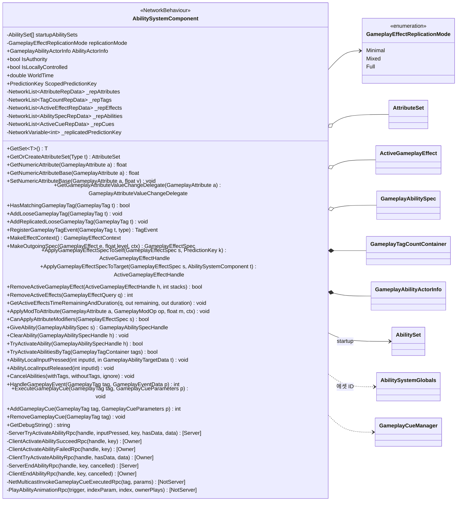
```mermaid
classDiagram
    direction LR

    class AbilitySystemComponent {
        <<NetworkBehaviour>>
        -AbilitySet[] startupAbilitySets
        -GameplayEffectReplicationMode replicationMode
        +GameplayAbilityActorInfo AbilityActorInfo
        +bool IsAuthority
        +bool IsLocallyControlled
        +double WorldTime
        +PredictionKey ScopedPredictionKey
        +GetSet~T~() T
        +GetOrCreateAttributeSet(Type t) AttributeSet
        +GetNumericAttribute(GameplayAttribute a) float
        +GetNumericAttributeBase(GameplayAttribute a) float
        +SetNumericAttributeBase(GameplayAttribute a, float v) void
        +GetGameplayAttributeValueChangeDelegate(GameplayAttribute a) GameplayAttributeValueChangeDelegate
        +HasMatchingGameplayTag(GameplayTag t) bool
        +AddLooseGameplayTag(GameplayTag t) void
        +AddReplicatedLooseGameplayTag(GameplayTag t) void
        +RegisterGameplayTagEvent(GameplayTag t, type) TagEvent
        +MakeEffectContext() GameplayEffectContext
        +MakeOutgoingSpec(GameplayEffect e, float level, ctx) GameplayEffectSpec
        +ApplyGameplayEffectSpecToSelf(GameplayEffectSpec s, PredictionKey k) ActiveGameplayEffectHandle
        +ApplyGameplayEffectSpecToTarget(GameplayEffectSpec s, AbilitySystemComponent t) ActiveGameplayEffectHandle
        +RemoveActiveGameplayEffect(ActiveGameplayEffectHandle h, int stacks) bool
        +RemoveActiveEffects(GameplayEffectQuery q) int
        +GetActiveEffectsTimeRemainingAndDuration(q, out remaining, out duration) void
        +ApplyModToAttribute(GameplayAttribute a, GameplayModOp op, float m, ctx) void
        +CanApplyAttributeModifiers(GameplayEffectSpec s) bool
        +GiveAbility(GameplayAbilitySpec s) GameplayAbilitySpecHandle
        +ClearAbility(GameplayAbilitySpecHandle h) void
        +TryActivateAbility(GameplayAbilitySpecHandle h) bool
        +TryActivateAbilitiesByTag(GameplayTagContainer tags) bool
        +AbilityLocalInputPressed(int inputId, in GameplayAbilityTargetData t) void
        +AbilityLocalInputReleased(int inputId) void
        +CancelAbilities(withTags, withoutTags, ignore) void
        +HandleGameplayEvent(GameplayTag tag, GameplayEventData p) int
        +ExecuteGameplayCue(GameplayTag tag, GameplayCueParameters p) void
        +AddGameplayCue(GameplayTag tag, GameplayCueParameters p) int
        +RemoveGameplayCue(GameplayTag tag) void
        +GetDebugString() string
        -NetworkList~AttributeRepData~ _repAttributes
        -NetworkList~TagCountRepData~ _repTags
        -NetworkList~ActiveEffectRepData~ _repEffects
        -NetworkList~AbilitySpecRepData~ _repAbilities
        -NetworkList~ActiveCueRepData~ _repCues
        -NetworkVariable~int~ _replicatedPredictionKey
        -ServerTryActivateAbilityRpc(handle, inputPressed, key, hasData, data) [Server]
        -ClientActivateAbilitySucceedRpc(handle, key) [Owner]
        -ClientActivateAbilityFailedRpc(handle, key) [Owner]
        -ClientTryActivateAbilityRpc(handle, hasData, data) [Owner]
        -ServerEndAbilityRpc(handle, key, cancelled) [Server]
        -ClientEndAbilityRpc(handle, key, cancelled) [Owner]
        -NetMulticastInvokeGameplayCueExecutedRpc(tag, params) [NotServer]
        -PlayAbilityAnimationRpc(trigger, indexParam, index, ownerPlays) [NotServer]
    }

    class GameplayEffectReplicationMode {
        <<enumeration>>
        Minimal
        Mixed
        Full
    }

    AbilitySystemComponent --> GameplayEffectReplicationMode
    AbilitySystemComponent o-- AttributeSet
    AbilitySystemComponent o-- ActiveGameplayEffect
    AbilitySystemComponent o-- GameplayAbilitySpec
    AbilitySystemComponent *-- GameplayTagCountContainer
    AbilitySystemComponent *-- GameplayAbilityActorInfo
    AbilitySystemComponent --> AbilitySet : startup
    AbilitySystemComponent ..> AbilitySystemGlobals : 에셋 ID
    AbilitySystemComponent ..> GameplayCueManager
```

---

## 5. Foundation — 인프라

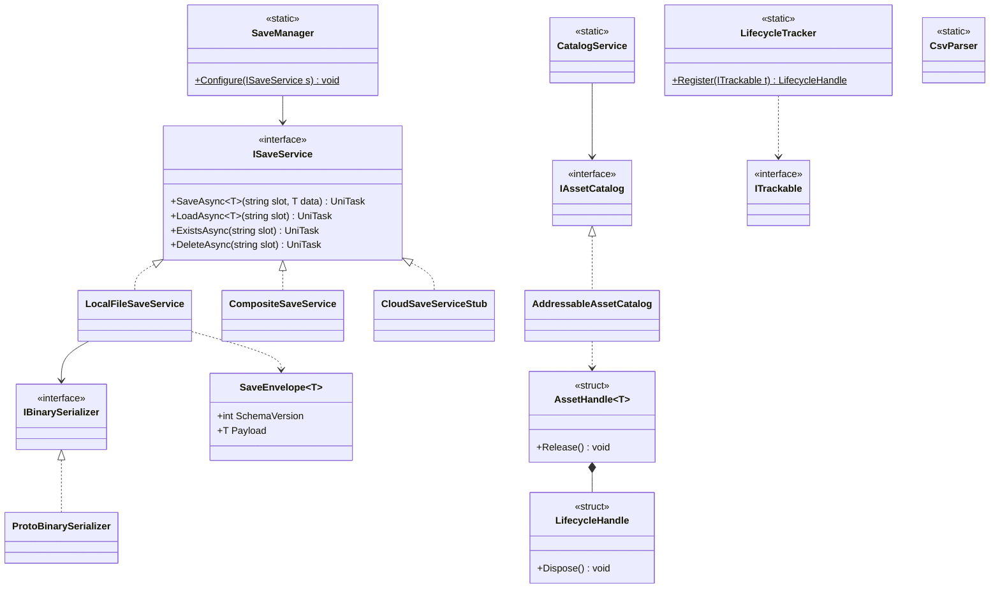
```mermaid
classDiagram
    direction TB

    class ISaveService {
        <<interface>>
        +SaveAsync~T~(string slot, T data) UniTask
        +LoadAsync~T~(string slot) UniTask
        +ExistsAsync(string slot) UniTask
        +DeleteAsync(string slot) UniTask
    }
    class SaveManager {
        <<static>>
        +Configure(ISaveService s)$ void
    }
    class LocalFileSaveService
    class CompositeSaveService
    class CloudSaveServiceStub
    class IBinarySerializer {
        <<interface>>
    }
    class ProtoBinarySerializer
    class SaveEnvelope~T~ {
        +int SchemaVersion
        +T Payload
    }
    class IAssetCatalog {
        <<interface>>
    }
    class AddressableAssetCatalog
    class CatalogService {
        <<static>>
    }
    class AssetHandle~T~ {
        <<struct>>
        +Release() void
    }
    class LifecycleTracker {
        <<static>>
        +Register(ITrackable t)$ LifecycleHandle
    }
    class LifecycleHandle {
        <<struct>>
        +Dispose() void
    }
    class ITrackable {
        <<interface>>
    }
    class CsvParser {
        <<static>>
    }

    ISaveService <|.. LocalFileSaveService
    ISaveService <|.. CompositeSaveService
    ISaveService <|.. CloudSaveServiceStub
    SaveManager --> ISaveService
    LocalFileSaveService --> IBinarySerializer
    LocalFileSaveService ..> SaveEnvelope
    IBinarySerializer <|.. ProtoBinarySerializer
    IAssetCatalog <|.. AddressableAssetCatalog
    CatalogService --> IAssetCatalog
    AddressableAssetCatalog ..> AssetHandle
    AssetHandle *-- LifecycleHandle
    LifecycleTracker ..> ITrackable
```

---

## 6. Foundation — Editor

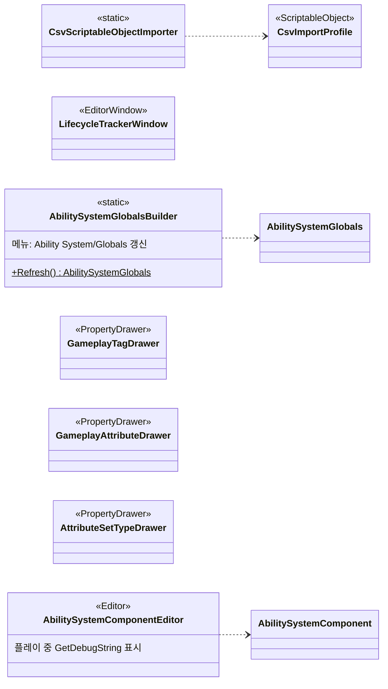
```mermaid
classDiagram
    direction LR
    class CsvImportProfile {
        <<ScriptableObject>>
    }
    class CsvScriptableObjectImporter {
        <<static>>
    }
    class LifecycleTrackerWindow {
        <<EditorWindow>>
    }
    class AbilitySystemGlobalsBuilder {
        <<static>>
        메뉴: Ability System/Globals 갱신
        +Refresh()$ AbilitySystemGlobals
    }
    class GameplayTagDrawer {
        <<PropertyDrawer>>
    }
    class GameplayAttributeDrawer {
        <<PropertyDrawer>>
    }
    class AttributeSetTypeDrawer {
        <<PropertyDrawer>>
    }
    class AbilitySystemComponentEditor {
        <<Editor>>
        플레이 중 GetDebugString 표시
    }
    CsvScriptableObjectImporter ..> CsvImportProfile
    AbilitySystemGlobalsBuilder ..> AbilitySystemGlobals
    AbilitySystemComponentEditor ..> AbilitySystemComponent
```

---

## 7. Runtime — Abilities (GAS 게임 쪽)

`Assets/Scripts/Abilities` · 네임스페이스 `ActionRPG.Abilities`

```mermaid
classDiagram
    direction TB

    class HealthSet {
        +GameplayAttributeData Health
        +GameplayAttributeData MaxHealth
        +GameplayAttributeData IncomingDamage [meta]
        +GameplayAttributeData IncomingHealing [meta]
        +GameplayAttribute HealthAttribute$
        +event OnDamageTaken
        +event OnOutOfHealth
        +ResetOutOfHealth() void
    }
    class ManaSet {
        +GameplayAttributeData Mana
        +GameplayAttributeData MaxMana
        +GameplayAttributeData ManaRegen
    }
    class CombatSet {
        +GameplayAttributeData AttackPower
        +GameplayAttributeData AbilityPower
        +GameplayAttributeData Defense
        +GameplayAttributeData MoveSpeed
        +GameplayAttributeData AttackSpeed
        +GameplayAttributeData CritChance
        +GameplayAttributeData CritDamage
        +GameplayAttributeData CooldownReduction
    }
    class AttributeInitializer {
        <<static>>
        +ApplyStatBlock(AbilitySystemComponent asc, in StatBlock s)$ void
        +ReadStatBlock(AbilitySystemComponent asc)$ StatBlock
    }
    class DamageExecution {
        <<ScriptableObject>>
        Source AP/ABP/Crit 스냅샷 · Target Defense
    }
    class HealExecution {
        <<ScriptableObject>>
    }
    class CooldownMagnitudeCalculation {
        <<ScriptableObject>>
        +bool ApplyCooldownReduction
        +bool DivideByAttackSpeed
    }
    class ActionRPGGameData {
        <<ScriptableObject>>
        +GameplayEffect DamageGameplayEffect_SetByCaller
        +GameplayEffect HealGameplayEffect_SetByCaller
        +GameplayEffect ManaCostGameplayEffect
        +GameplayEffect SkillCooldownGameplayEffect
        +GameplayEffect GlobalCooldownGameplayEffect
        +GameplayEffect InvulnerableGameplayEffect
        +Get()$ ActionRPGGameData
    }
    class CombatSpecs {
        <<static>>
        +MakeDamageSpec(source, ctx, flat, ap, abp, type, knockback, stagger, level)$ GameplayEffectSpec
        +MakeHealSpec(source, ctx, flat, abp, maxPct, level)$ GameplayEffectSpec
        +MakeHitContext(source, ability, point, dir)$ GameplayEffectContext
        +ApplyToTarget(source, spec, target)$ void
        +ApplyEffectToTarget(source, effect, target, level)$ void
    }
    class GA_BasicAttack {
        <<ScriptableObject>>
        +AttackProfile[] Profiles
    }
    class AttackProfile {
        +WeaponType Weapon
        +float WindupTime
        +float Cooldown
        +float MovementLockTime
        +float[] ComboMultipliers
        +float Range
        +float ArcDegrees
        +GameObject ProjectilePrefab
    }
    class GameTags {
        <<static>>
        State.* · Cooldown.* · SetByCaller.* · Damage.Type.* · GameplayCue.*
        +SkillCooldown(ushort id)$ GameplayTag
    }
    class AbilityInputID {
        <<static>>
        Skill1..4 = 0..3
        BasicAttack = 10
    }

    AttributeSet <|-- HealthSet
    AttributeSet <|-- ManaSet
    AttributeSet <|-- CombatSet
    GameplayEffectExecutionCalculation <|-- DamageExecution
    GameplayEffectExecutionCalculation <|-- HealExecution
    GameplayModMagnitudeCalculation <|-- CooldownMagnitudeCalculation
    GameplayAbility <|-- GA_BasicAttack
    GA_BasicAttack *-- AttackProfile
    GA_BasicAttack ..> CombatSpecs
    GA_BasicAttack ..> Projectile
    CombatSpecs ..> ActionRPGGameData
    DamageExecution ..> HealthSet : IncomingDamage
    HealExecution ..> HealthSet : IncomingHealing
    AttributeInitializer ..> StatBlock
```

---

## 8. Runtime — Character · Combat

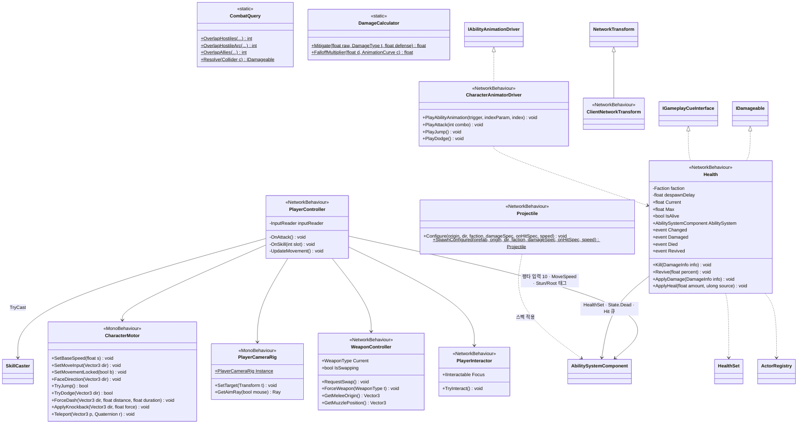
```mermaid
classDiagram
    direction TB

    class PlayerController {
        <<NetworkBehaviour>>
        -InputReader inputReader
        -OnAttack() void
        -OnSkill(int slot) void
        -UpdateMovement() void
    }
    class CharacterMotor {
        <<MonoBehaviour>>
        +SetBaseSpeed(float s) void
        +SetMoveInput(Vector3 dir) void
        +SetMovementLocked(bool b) void
        +FaceDirection(Vector3 dir) void
        +TryJump() bool
        +TryDodge(Vector3 dir) bool
        +ForceDash(Vector3 dir, float distance, float duration) void
        +ApplyKnockback(Vector3 dir, float force) void
        +Teleport(Vector3 p, Quaternion r) void
    }
    class WeaponController {
        <<NetworkBehaviour>>
        +WeaponType Current
        +bool IsSwapping
        +RequestSwap() void
        +ForceWeapon(WeaponType t) void
        +GetMeleeOrigin() Vector3
        +GetMuzzlePosition() Vector3
    }
    class CharacterAnimatorDriver {
        <<NetworkBehaviour>>
        +PlayAbilityAnimation(trigger, indexParam, index) void
        +PlayAttack(int combo) void
        +PlayJump() void
        +PlayDodge() void
    }
    class PlayerInteractor {
        <<NetworkBehaviour>>
        +IInteractable Focus
        +TryInteract() void
    }
    class PlayerCameraRig {
        <<MonoBehaviour>>
        +PlayerCameraRig Instance$
        +SetTarget(Transform t) void
        +GetAimRay(bool mouse) Ray
    }
    class ClientNetworkTransform {
        <<NetworkBehaviour>>
    }
    class Health {
        <<NetworkBehaviour>>
        -Faction faction
        -float despawnDelay
        +float Current
        +float Max
        +bool IsAlive
        +AbilitySystemComponent AbilitySystem
        +event Changed
        +event Damaged
        +event Died
        +event Revived
        +Kill(DamageInfo info) void
        +Revive(float percent) void
        +ApplyDamage(DamageInfo info) void
        +ApplyHeal(float amount, ulong source) void
    }
    class Projectile {
        <<NetworkBehaviour>>
        +Configure(origin, dir, faction, damageSpec, onHitSpec, speed) void
        +SpawnConfigured(prefab, origin, dir, faction, damageSpec, onHitSpec, speed)$ Projectile
    }
    class CombatQuery {
        <<static>>
        +OverlapHostiles(...)$ int
        +OverlapHostileArc(...)$ int
        +OverlapAllies(...)$ int
        +Resolve(Collider c)$ IDamageable
    }
    class DamageCalculator {
        <<static>>
        +Mitigate(float raw, DamageType t, float defense)$ float
        +FalloffMultiplier(float d, AnimationCurve c)$ float
    }

    IDamageable <|.. Health
    IGameplayCueInterface <|.. Health
    IAbilityAnimationDriver <|.. CharacterAnimatorDriver
    NetworkTransform <|-- ClientNetworkTransform

    PlayerController --> AbilitySystemComponent : 평타 입력 10 · MoveSpeed · Stun/Root 태그
    PlayerController --> SkillCaster : TryCast
    PlayerController --> CharacterMotor
    PlayerController --> PlayerCameraRig
    PlayerController --> WeaponController
    PlayerController --> PlayerInteractor
    Health --> AbilitySystemComponent : HealthSet · State.Dead · Hit 큐
    Health ..> HealthSet
    Health ..> ActorRegistry
    Projectile ..> AbilitySystemComponent : 스펙 적용
    CharacterAnimatorDriver ..> Health
```

---

## 9. Runtime — Skills

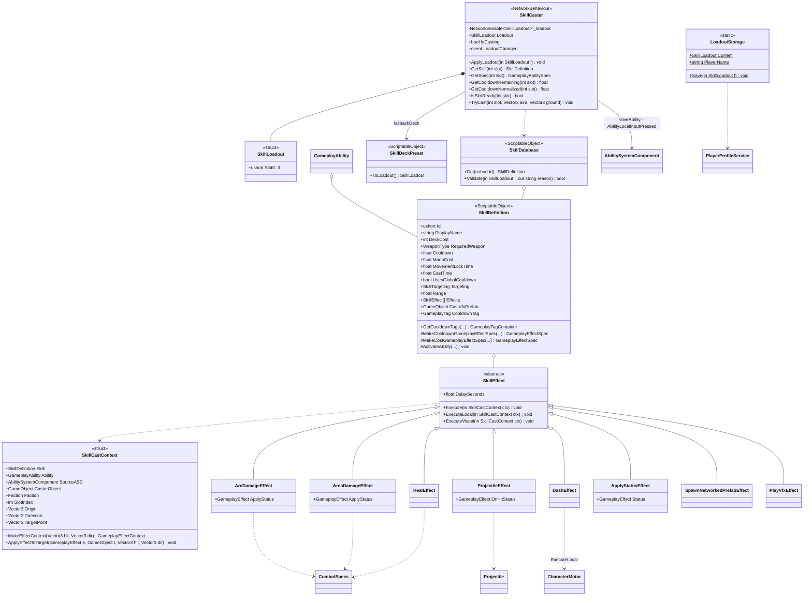
```mermaid
classDiagram
    direction TB

    class SkillDefinition {
        <<ScriptableObject>>
        +ushort Id
        +string DisplayName
        +int DeckCost
        +WeaponType RequiredWeapon
        +float Cooldown
        +float ManaCost
        +float MovementLockTime
        +float CastTime
        +bool UsesGlobalCooldown
        +SkillTargeting Targeting
        +float Range
        +SkillEffect[] Effects
        +GameObject CastVfxPrefab
        +GameplayTag CooldownTag
        +GetCooldownTags(...) GameplayTagContainer
        #MakeCooldownGameplayEffectSpec(...) GameplayEffectSpec
        #MakeCostGameplayEffectSpec(...) GameplayEffectSpec
        #ActivateAbility(...) void
    }
    class SkillEffect {
        <<abstract>>
        +float DelaySeconds
        +Execute(in SkillCastContext ctx) void
        +ExecuteLocal(in SkillCastContext ctx) void
        +ExecuteVisual(in SkillCastContext ctx) void
    }
    class SkillCastContext {
        <<struct>>
        +SkillDefinition Skill
        +GameplayAbility Ability
        +AbilitySystemComponent SourceASC
        +GameObject CasterObject
        +Faction Faction
        +int SlotIndex
        +Vector3 Origin
        +Vector3 Direction
        +Vector3 TargetPoint
        +MakeEffectContext(Vector3 hit, Vector3 dir) GameplayEffectContext
        +ApplyEffectToTarget(GameplayEffect e, GameObject t, Vector3 hit, Vector3 dir) void
    }
    class ArcDamageEffect {
        +GameplayEffect ApplyStatus
    }
    class AreaDamageEffect {
        +GameplayEffect ApplyStatus
    }
    class ProjectileEffect {
        +GameplayEffect OnHitStatus
    }
    class DashEffect
    class HealEffect
    class ApplyStatusEffect {
        +GameplayEffect Status
    }
    class SpawnNetworkedPrefabEffect
    class PlayVfxEffect

    class SkillCaster {
        <<NetworkBehaviour>>
        -NetworkVariable~SkillLoadout~ _loadout
        +SkillLoadout Loadout
        +bool IsCasting
        +event LoadoutChanged
        +ApplyLoadout(in SkillLoadout l) void
        +GetSkill(int slot) SkillDefinition
        +GetSpec(int slot) GameplayAbilitySpec
        +GetCooldownRemaining(int slot) float
        +GetCooldownNormalized(int slot) float
        +IsSlotReady(int slot) bool
        +TryCast(int slot, Vector3 aim, Vector3 ground) void
    }
    class SkillLoadout {
        <<struct>>
        +ushort Slot0..3
    }
    class SkillDatabase {
        <<ScriptableObject>>
        +Get(ushort id) SkillDefinition
        +Validate(in SkillLoadout l, out string reason) bool
    }
    class SkillDeckPreset {
        <<ScriptableObject>>
        +ToLoadout() SkillLoadout
    }
    class LoadoutStorage {
        <<static>>
        +SkillLoadout Current$
        +string PlayerName$
        +Save(in SkillLoadout l)$ void
    }

    GameplayAbility <|-- SkillDefinition
    SkillDefinition o-- SkillEffect
    SkillEffect <|-- ArcDamageEffect
    SkillEffect <|-- AreaDamageEffect
    SkillEffect <|-- ProjectileEffect
    SkillEffect <|-- DashEffect
    SkillEffect <|-- HealEffect
    SkillEffect <|-- ApplyStatusEffect
    SkillEffect <|-- SpawnNetworkedPrefabEffect
    SkillEffect <|-- PlayVfxEffect
    SkillEffect ..> SkillCastContext
    SkillCaster --> AbilitySystemComponent : GiveAbility · AbilityLocalInputPressed
    SkillCaster *-- SkillLoadout
    SkillCaster ..> SkillDatabase
    SkillCaster --> SkillDeckPreset : fallbackDeck
    SkillDatabase o-- SkillDefinition
    ArcDamageEffect ..> CombatSpecs
    AreaDamageEffect ..> CombatSpecs
    ProjectileEffect ..> Projectile
    HealEffect ..> CombatSpecs
    DashEffect ..> CharacterMotor : ExecuteLocal
    LoadoutStorage ..> PlayerProfileService
```

---

## 10. Runtime — AI

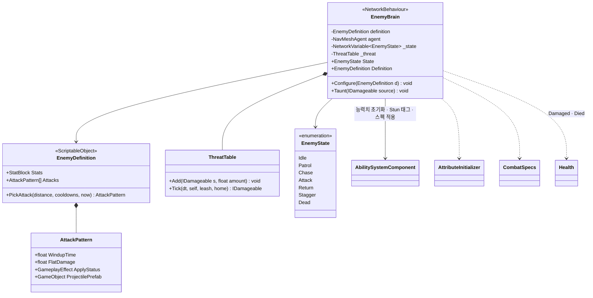
```mermaid
classDiagram
    direction TB
    class EnemyBrain {
        <<NetworkBehaviour>>
        -EnemyDefinition definition
        -NavMeshAgent agent
        -NetworkVariable~EnemyState~ _state
        -ThreatTable _threat
        +EnemyState State
        +EnemyDefinition Definition
        +Configure(EnemyDefinition d) void
        +Taunt(IDamageable source) void
    }
    class EnemyDefinition {
        <<ScriptableObject>>
        +StatBlock Stats
        +AttackPattern[] Attacks
        +PickAttack(distance, cooldowns, now) AttackPattern
    }
    class AttackPattern {
        +float WindupTime
        +float FlatDamage
        +GameplayEffect ApplyStatus
        +GameObject ProjectilePrefab
    }
    class ThreatTable {
        +Add(IDamageable s, float amount) void
        +Tick(dt, self, leash, home) IDamageable
    }
    class EnemyState {
        <<enumeration>>
        Idle
        Patrol
        Chase
        Attack
        Return
        Stagger
        Dead
    }
    EnemyBrain --> EnemyDefinition
    EnemyBrain *-- ThreatTable
    EnemyBrain --> EnemyState
    EnemyBrain --> AbilitySystemComponent : 능력치 초기화 · Stun 태그 · 스펙 적용
    EnemyBrain ..> AttributeInitializer
    EnemyBrain ..> CombatSpecs
    EnemyBrain ..> Health : Damaged · Died
    EnemyDefinition *-- AttackPattern
```

---

## 11. Runtime — Networking

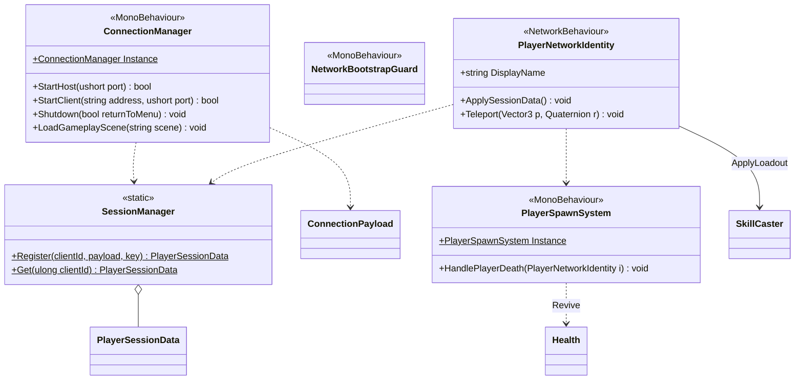
```mermaid
classDiagram
    direction TB
    class ConnectionManager {
        <<MonoBehaviour>>
        +ConnectionManager Instance$
        +StartHost(ushort port) bool
        +StartClient(string address, ushort port) bool
        +Shutdown(bool returnToMenu) void
        +LoadGameplayScene(string scene) void
    }
    class NetworkBootstrapGuard {
        <<MonoBehaviour>>
    }
    class SessionManager {
        <<static>>
        +Register(clientId, payload, key)$ PlayerSessionData
        +Get(ulong clientId)$ PlayerSessionData
    }
    class ConnectionPayload
    class PlayerSessionData
    class PlayerNetworkIdentity {
        <<NetworkBehaviour>>
        +string DisplayName
        +ApplySessionData() void
        +Teleport(Vector3 p, Quaternion r) void
    }
    class PlayerSpawnSystem {
        <<MonoBehaviour>>
        +PlayerSpawnSystem Instance$
        +HandlePlayerDeath(PlayerNetworkIdentity i) void
    }
    ConnectionManager ..> SessionManager
    ConnectionManager ..> ConnectionPayload
    SessionManager o-- PlayerSessionData
    PlayerNetworkIdentity ..> SessionManager
    PlayerNetworkIdentity --> SkillCaster : ApplyLoadout
    PlayerNetworkIdentity ..> PlayerSpawnSystem
    PlayerSpawnSystem ..> Health : Revive
```

---

## 12. Runtime — Dungeon

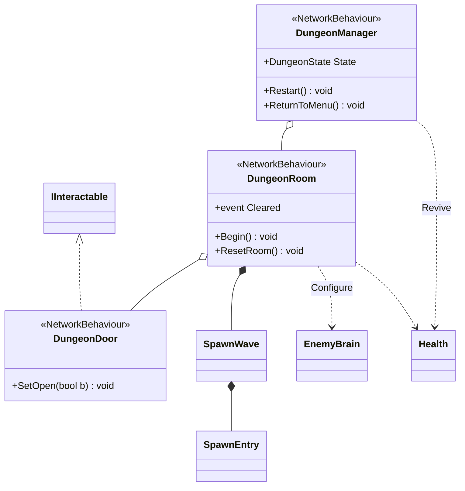
```mermaid
classDiagram
    direction TB
    class DungeonManager {
        <<NetworkBehaviour>>
        +DungeonState State
        +Restart() void
        +ReturnToMenu() void
    }
    class DungeonRoom {
        <<NetworkBehaviour>>
        +Begin() void
        +ResetRoom() void
        +event Cleared
    }
    class DungeonDoor {
        <<NetworkBehaviour>>
        +SetOpen(bool b) void
    }
    class SpawnWave
    class SpawnEntry
    IInteractable <|.. DungeonDoor
    DungeonManager o-- DungeonRoom
    DungeonRoom *-- SpawnWave
    SpawnWave *-- SpawnEntry
    DungeonRoom o-- DungeonDoor
    DungeonRoom ..> EnemyBrain : Configure
    DungeonRoom ..> Health
    DungeonManager ..> Health : Revive
```

---

## 13. Runtime — Tutorial

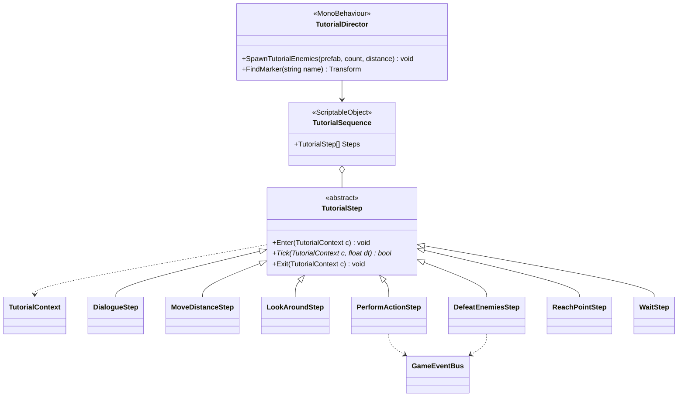
```mermaid
classDiagram
    direction TB
    class TutorialDirector {
        <<MonoBehaviour>>
        +SpawnTutorialEnemies(prefab, count, distance) void
        +FindMarker(string name) Transform
    }
    class TutorialSequence {
        <<ScriptableObject>>
        +TutorialStep[] Steps
    }
    class TutorialStep {
        <<abstract>>
        +Enter(TutorialContext c) void
        +Tick(TutorialContext c, float dt)* bool
        +Exit(TutorialContext c) void
    }
    class TutorialContext
    TutorialStep <|-- DialogueStep
    TutorialStep <|-- MoveDistanceStep
    TutorialStep <|-- LookAroundStep
    TutorialStep <|-- PerformActionStep
    TutorialStep <|-- DefeatEnemiesStep
    TutorialStep <|-- ReachPointStep
    TutorialStep <|-- WaitStep
    TutorialDirector --> TutorialSequence
    TutorialSequence o-- TutorialStep
    TutorialStep ..> TutorialContext
    PerformActionStep ..> GameEventBus
    DefeatEnemiesStep ..> GameEventBus
```

---

## 14. Runtime — Input · UI · Save · Data

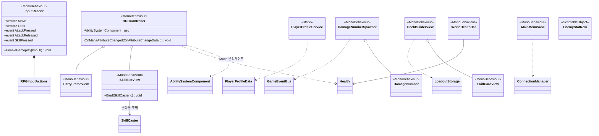
```mermaid
classDiagram
    direction TB
    class InputReader {
        <<MonoBehaviour>>
        +Vector2 Move
        +Vector2 Look
        +event AttackPressed
        +event AttackReleased
        +event SkillPressed
        +EnableGameplay(bool b) void
    }
    class RPGInputActions
    class HUDController {
        <<MonoBehaviour>>
        -AbilitySystemComponent _asc
        -OnManaAttributeChanged(OnAttributeChangeData d) void
    }
    class SkillSlotView {
        <<MonoBehaviour>>
        +Bind(SkillCaster c) void
    }
    class PartyFrameView {
        <<MonoBehaviour>>
    }
    class DamageNumberSpawner {
        <<MonoBehaviour>>
    }
    class DamageNumber {
        <<MonoBehaviour>>
    }
    class WorldHealthBar {
        <<MonoBehaviour>>
    }
    class MainMenuView {
        <<MonoBehaviour>>
    }
    class DeckBuilderView {
        <<MonoBehaviour>>
    }
    class SkillCardView {
        <<MonoBehaviour>>
    }
    class PlayerProfileService {
        <<static>>
    }
    class PlayerProfileData
    class EnemyStatRow {
        <<ScriptableObject>>
    }

    InputReader *-- RPGInputActions
    HUDController ..> AbilitySystemComponent : Mana 델리게이트
    HUDController ..> Health
    HUDController o-- SkillSlotView
    HUDController o-- PartyFrameView
    SkillSlotView --> SkillCaster : 쿨다운 조회
    DamageNumberSpawner o-- DamageNumber
    DamageNumberSpawner ..> GameEventBus
    WorldHealthBar --> Health
    DeckBuilderView o-- SkillCardView
    DeckBuilderView ..> LoadoutStorage
    MainMenuView ..> ConnectionManager
    PlayerProfileService ..> PlayerProfileData
```

---

## 15. Editor 도구

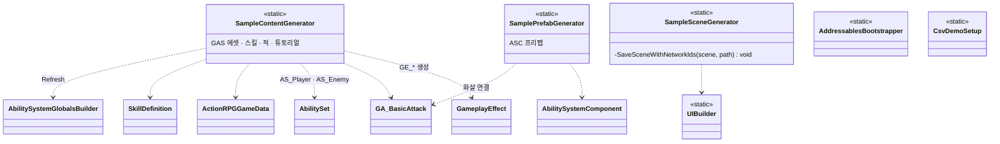
```mermaid
classDiagram
    direction TB
    class SampleContentGenerator {
        <<static>>
        GAS 에셋 · 스킬 · 적 · 튜토리얼
    }
    class SamplePrefabGenerator {
        <<static>>
        ASC 프리팹
    }
    class SampleSceneGenerator {
        <<static>>
        -SaveSceneWithNetworkIds(scene, path) void
    }
    class AddressablesBootstrapper {
        <<static>>
    }
    class CsvDemoSetup {
        <<static>>
    }
    class UIBuilder {
        <<static>>
    }
    SampleContentGenerator ..> GameplayEffect : GE_* 생성
    SampleContentGenerator ..> GA_BasicAttack
    SampleContentGenerator ..> AbilitySet : AS_Player · AS_Enemy
    SampleContentGenerator ..> ActionRPGGameData
    SampleContentGenerator ..> SkillDefinition
    SampleContentGenerator ..> AbilitySystemGlobalsBuilder : Refresh
    SamplePrefabGenerator ..> AbilitySystemComponent
    SamplePrefabGenerator ..> GA_BasicAttack : 화살 연결
    SampleSceneGenerator ..> UIBuilder
```

---

## 16. 전체 개요

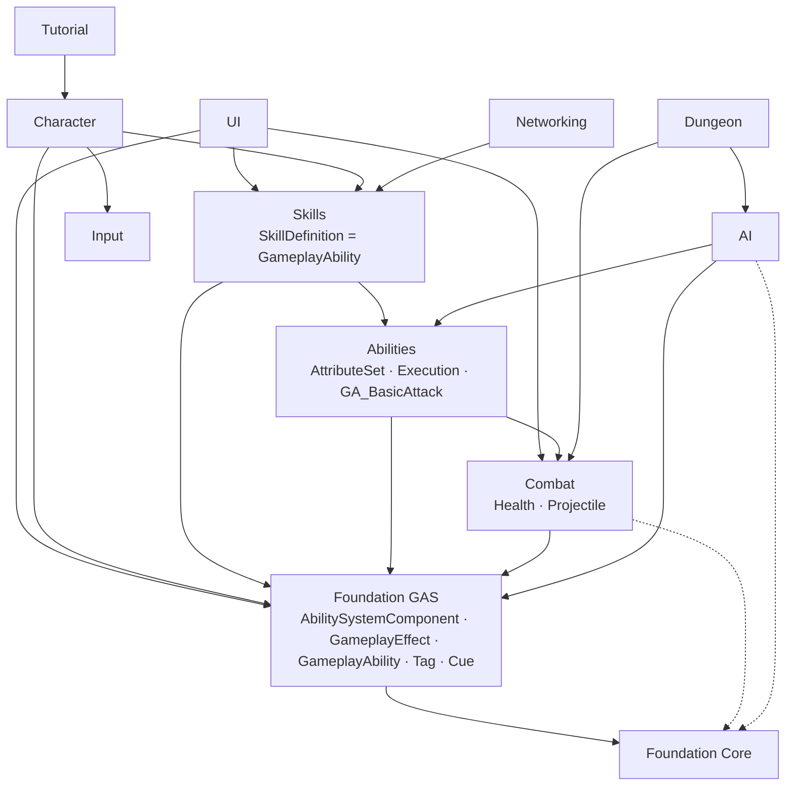
```mermaid
flowchart TB
    UI["UI"]
    NET["Networking"]
    CHAR["Character"]
    SKILL["Skills<br/>SkillDefinition = GameplayAbility"]
    ABIL["Abilities<br/>AttributeSet · Execution · GA_BasicAttack"]
    COMBAT["Combat<br/>Health · Projectile"]
    AI["AI"]
    DUN["Dungeon"]
    TUT["Tutorial"]
    INPUT["Input"]
    GAS["Foundation GAS<br/>AbilitySystemComponent · GameplayEffect · GameplayAbility · Tag · Cue"]
    CORE["Foundation Core"]

    UI --> SKILL
    UI --> COMBAT
    UI --> GAS
    CHAR --> INPUT
    CHAR --> SKILL
    CHAR --> GAS
    SKILL --> ABIL
    SKILL --> GAS
    ABIL --> GAS
    ABIL --> COMBAT
    COMBAT --> GAS
    AI --> ABIL
    AI --> GAS
    NET --> SKILL
    DUN --> AI
    DUN --> COMBAT
    TUT --> CHAR
    GAS --> CORE
    COMBAT -.-> CORE
    AI -.-> CORE
```
